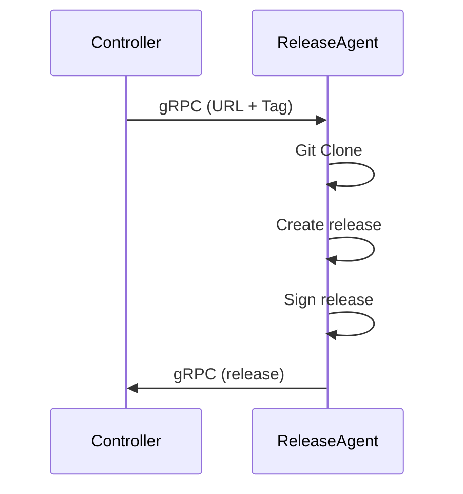

# Architecture Document for Release Agent Component

## Glossary

- **release** : A release is an archive ".git.tgz.sig" containing the source code of a project and its signature. The release is signed by the release agent using a private certificates. The public key is used to verify the signature.
- **release agent** : The release agent is a component that is responsible for creating and signing releases.


## Description

The release agent is a component that is responsible for creating and signing releases for any project. The release agent is designed to be used in a CI/CD pipeline.
When a watched repository contains a new tag, the controller triggers the release agent to create a release for the repository. Of course, the release agent is totally independent from the2

## External Communication

The release agent runs inside a lumper controlled virtual machine (VM).
The release agent communicates with the Controller with gRPC (Getting URL + Tag of the repository which needs a release).
It sends the signed release to the Controller via virtio-net



## Keys Management

The keys are stored in the VM Memory

## API

Here are all the gRPC interfaces
```protobuf
syntax = "proto3";

package releaseagent;

message ReleaseRequest {
    string url = 1;
    string tag = 2;
}

message ReleaseResponse {
    bytes release = 1;
}
```
